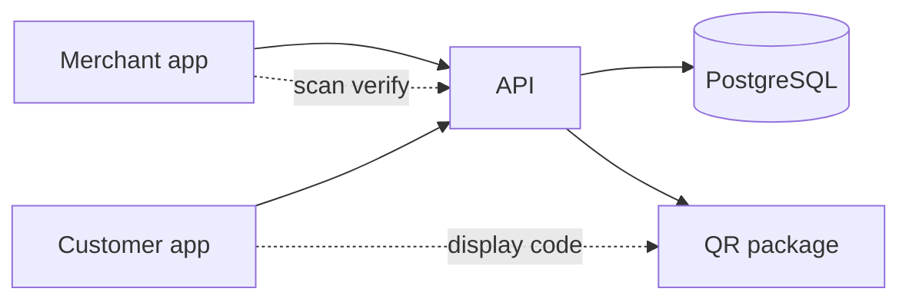

# Architecture

## Purpose

airRand orchestrates **pickup commerce** between merchants and customers without holding money or managing wallets. The platform records catalog data, orders, status transitions, and QR-based pickup verification only.

## System context

External systems (cash, card terminals, mobile money apps) handle payment **outside** airRand. Orders may reference an optional external payment note in a later phase, but never wallet balances or custody.

## Applications

### `apps/merchant`

- Product CRUD (Phase 3+)
- Incoming order queue
- Mark orders ready
- Scan and verify pickup QR

Does **not** process or display wallet balances.

### `apps/customer`

- Browse merchant catalog
- Cart and place order
- Show pickup QR after order

Does **not** collect card/bank details in MVP.

### `apps/api`

- Single backend for both clients
- Auth boundaries: merchant staff vs customer (Phase 1+)
- Enforces `packages/domain` rules on status changes
- Issues and verifies pickup tokens via `packages/qr`

## Packages

| Package | Responsibility |
|---------|----------------|
| `@airrand/contracts` | API request/response shapes (Zod); no business logic |
| `@airrand/domain` | Pure TS: valid order transitions, invariants |
| `@airrand/database` | Drizzle schema + migrations + client (Phase 1) |
| `@airrand/qr` | HMAC-SHA256 pickup tokens (`QR_SIGNING_SECRET`); payload: orderId, merchantId, issuedAt, expiresAt, nonce |
| `@airrand/config` | Shared TS/ESLint presets |

## Data ownership

- **Merchant** owns products and fulfills orders for their `merchant_id`.
- **Customer** creates orders scoped to one merchant per checkout.
- **API** is the only writer to the database from apps (no direct DB access from Next.js apps in production).

## Security principles (MVP)

- Tenant isolation: every query filtered by `merchant_id` where applicable.
- Pickup tokens: HMAC-SHA256 signed, 48h default TTL, nonce stored on order for replay binding, verified server-side on scan.
- No secrets in client bundles except public URLs.

## Explicit non-goals (MVP)

- Payment processing, escrow, refunds automation
- Wallets, balances, ledgers, settlements
- Multi-merchant single cart
- Delivery logistics

See [ADR 0001](./adr/0001-walletless-mvp.md).

## Tooling

- **pnpm** workspaces + **Turborepo** for task orchestration
- **TypeScript** strict mode everywhere
- **Next.js** for web apps; **Hono** for API
