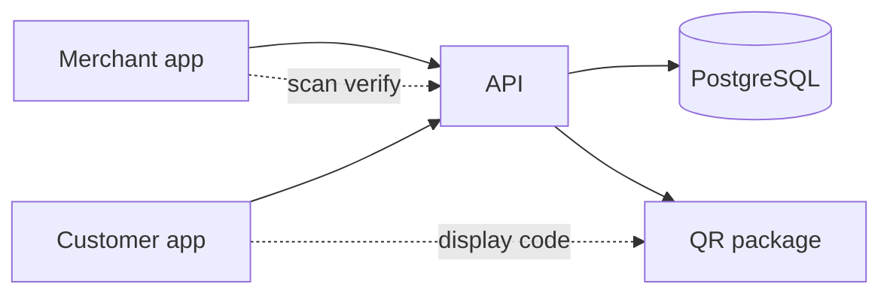
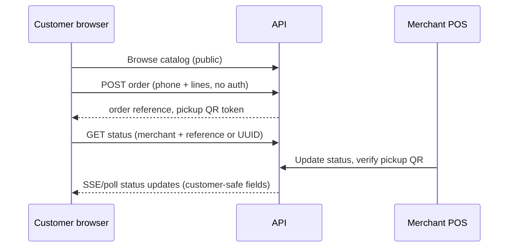

# Architecture

## Purpose

airRand orchestrates **pickup commerce** between merchants and customers without holding money or managing wallets. The platform records catalog data, orders, status transitions, and QR-based pickup verification only.

**Product positioning:** wallet-less commerce and pickup coordination for convenience stores, pharmacies, laundry services, small retail, and (future) verified “plugs.” See [market-scope.md](./market-scope.md) and [customer-data-policy.md](./customer-data-policy.md).

## System context

External systems (cash, card terminals, mobile money apps) handle payment **outside** airRand. Orders may reference an optional external payment note in a later phase, but never wallet balances or custody.

## Applications

### `apps/merchant`

- Product CRUD (Phase 3+)
- Incoming order queue
- Mark orders ready
- Scan and verify pickup QR

Does **not** process or display wallet balances.

### `apps/customer`

- Browse merchant catalog
- Cart and place order (**guest-first — no sign-up**)
- Collect **phone number** at checkout (lightweight identity)
- Show pickup QR after order
- Track order status by merchant + reference (mobile-first)

Target users: busy office workers, students, and mobile-first customers in African and similar low-friction commerce contexts. **Speed and accessibility** over account persistence.

Does **not** collect card/bank details, passwords, or create customer accounts in MVP.

### Customer flow (guest-first)

Future optional layers (not MVP): OTP on phone for status lookup; optional accounts while guest path remains default.

### `apps/api`

- Single backend for both clients
- Auth boundaries: **merchant staff only** (customers are unauthenticated guests)
- Enforces `packages/domain` rules on status changes
- Issues and verifies pickup tokens via `packages/qr`

### API and domain expectations (customer orders)

Documented contract intent for `POST /merchants/:merchantId/orders`:

| Field | Expectation |
|-------|-------------|
| `customer_contact` | **Required** — valid phone number; minimal format validation |
| `customer_name` | Optional — display/audit label only |
| `lines` | Required — at least one line item |
| Customer auth | **None** — no Bearer token, no cookies |

Public status endpoints expose **customer-safe** fields only (no staff data, no pickup nonce). Merchant-scoped routes always filter by `merchant_id`.

Order create requires `customer_contact` (phone) with minimal format validation; `customer_name` is optional.

### Operational notifications (Phase 10D)

Provider-agnostic **operational** messaging only — not marketing, analytics, payment receipts, or OTP verification.

| Component | Role |
|-----------|------|
| `@airrand/notifications` | Notification types, channel enums, Zod payload schemas, enqueue helper |
| `notification_jobs` | Durable job rows (`queued` → `processing` → `sent` \| `failed`) |
| `notification.requested` | BullMQ queue; worker validates and placeholder-dispatches |
| API | Enqueues on order `ready`, staff password reset (best-effort) |
| Worker | Enqueues audit export completed; processes all notification jobs |

**Channels (placeholders):** `sms_placeholder` (customer pickup ready), `email_placeholder` (staff export ready, password reset notice), `internal` reserved. No Twilio/Hubtel/SMTP integration yet. Future OTP can reuse `sms_placeholder` with a distinct notification type.

**No public notification APIs** for customers or merchants in this phase. Audit actions: `notification.queued`, `notification.sent`, `notification.failed`.

**Brand alignment:** In-app notification feedback uses existing `AlertMessage` / `NotificationFeedback` primitives and semantic tokens (success for actions, info for queued jobs). Placeholder SMS/email copy lives in `@airrand/notifications/templates` — operational tone, orange-accent merchant UI unchanged. See [design-system.md](./design-system.md).

## Catalog organization (Phase 11A)

| Component | Role |
|-----------|------|
| `product_categories` | Merchant-scoped grouping (name, optional `icon_key`, sort order, active flag) |
| `products.category_id` | Optional FK; inactive categories hide products from customer catalog |
| `products.stock_state` | `in_stock`, `low_stock`, `out_of_stock` — controls orderability |
| `products.stock_quantity` | Optional informational count only (no auto-decrement) |

**Availability rule:** a product is customer-visible and orderable when `is_available = true`, `stock_state != out_of_stock`, and its category (if any) is active. Merchant POS shows stock badges and category filters; customer storefront uses category chips.

Pharmacy prescription workflows, laundry service scheduling, and plug verification remain **deferred** (see [market-scope.md](./market-scope.md)).

## Merchant operational attention (Phase 11B)

Pilot-facing alerts on the merchant **Order Line** reuse existing SSE — no WebSocket migration and no order lifecycle API changes.

| Module | Role |
|--------|------|
| `useOperationalAttention` | Coordinates sound, browser notifications, unread/highlight state, focus mode, reconnect dedupe |
| `useMerchantRealtime` | SSE + polling fallback; forwards parsed events to attention hook |
| `operational-attention/*` | Pure helpers: new-order detection, event-id dedupe, Web Audio chime, `Notification` API wrapper, `localStorage` preferences |

**Sound:** `order.created` only. Chime uses Web Audio (no external asset). Mute preference: `airrand_merchant_alerts_muted` in `localStorage`.

**Browser notifications:** Gated on `Notification.permission === "granted"` after explicit **Enable notifications** click. Tags dedupe by event type + order id. `order.created` and optional `order.status_changed` → `ready`.

**Reconnect:** On SSE open after disconnect, `beginReconnectReconcile` / `syncOrdersAfterLoad` compare order id sets so baseline refresh does not treat existing orders as new.

**Focus mode:** `airrand_merchant_focus_mode` in `localStorage`; CSS class on POS shell hides catalog grid emphasis.

**Orders list:** Client-side `filterOrdersByStatus` on `/orders` — API list unchanged.

## Unified brand tokens (`@airrand/brand`)

Canonical CSS variables (`--airrand-*`) live in `packages/brand/tokens/airrand-tokens.css`. Merchant and customer apps import and alias to `--pos-*` / `--store-*` so alerts, badges, chips, and onboarding surfaces stay visually aligned without duplicating hex values.

## Product-first customer experience

| Component | Role |
|-----------|------|
| `HomeBrowse` | Customer `/` — default **Browse** tab aggregates available products across merchants (client-side); **Shops** tab lists storefronts |
| `catalog-discovery.ts` | Loads merchants + `fetchAvailableProductsBySlug` per shop; groups/filters by category |
| `CatalogProductCard` | Commerce-oriented card — product name dominant; merchant link secondary |
| `@airrand/product-icons` | Shared deterministic icon mapping (keyword → category iconKey → generic) |

No new recommendation API; no multi-merchant cart on home (checkout remains per-store).

## Audit export storage (Phase 10E)

| Component | Role |
|-----------|------|
| `@airrand/storage` | Provider-agnostic object storage boundary (`StorageProvider`, MinIO via AWS S3 SDK) |
| Worker | Builds CSV in memory, `uploadObject` to `audit-exports/{merchantId}/{exportJobId}.csv`, persists `object_key` |
| API | Authenticated `GET .../download` streams via `getObjectStream` — no public bucket URLs |
| `audit_export_jobs` | `object_key` references stored object (replaces local `file_path`) |

**MinIO** is the first implementation (local `docker compose`). Production can point the same SDK at any S3-compatible endpoint without changing export flow. Bucket access is private; credentials stay server-side. `/ready` includes a storage bucket check.

## Packages

| Package | Responsibility |
|---------|----------------|
| `@airrand/contracts` | API request/response shapes (Zod); no business logic |
| `@airrand/domain` | Pure TS: valid order transitions, invariants |
| `@airrand/database` | Drizzle schema + migrations + client (Phase 1) |
| `@airrand/jobs` | BullMQ queue names and job payload schemas |
| `@airrand/notifications` | Operational notification contracts and enqueue |
| `@airrand/storage` | Object storage adapter (audit exports only; MinIO / S3-compatible) |
| `@airrand/qr` | HMAC-SHA256 pickup tokens (`QR_SIGNING_SECRET`); payload: orderId, merchantId, issuedAt, expiresAt, nonce |
| `@airrand/config` | Shared TS/ESLint presets |

## Data ownership

- **Merchant** owns products and fulfills orders for their `merchant_id`.
- **Customer** creates orders scoped to one merchant per checkout.
- **API** is the only writer to the database from apps (no direct DB access from Next.js apps in production).

## Security principles (MVP)

- Tenant isolation: every query filtered by `merchant_id` where applicable.
- Pickup tokens: HMAC-SHA256 signed, 48h default TTL, nonce stored on order for replay binding, verified server-side on scan.
- No secrets in client bundles except public URLs.

## Explicit non-goals (MVP)

- Payment processing, escrow, refunds automation
- Wallets, balances, ledgers, settlements
- Multi-merchant single cart
- Delivery logistics
- Plug onboarding, identity verification, or plug-specific APIs
- **Customer accounts**, saved payment methods, loyalty, recommendations
- **Customer analytics, profiling, or advertising**
- Customer OTP / SMS verification (future optional layer)
- **Marketing campaigns, promotional SMS/email, or analytics messaging**
- Push notification providers (FCM/APNs) — not implemented

See [ADR 0001](./adr/0001-walletless-mvp.md).

## Tooling

- **pnpm** workspaces + **Turborepo** for task orchestration
- **TypeScript** strict mode everywhere
- **Next.js** for web apps; **Hono** for API
