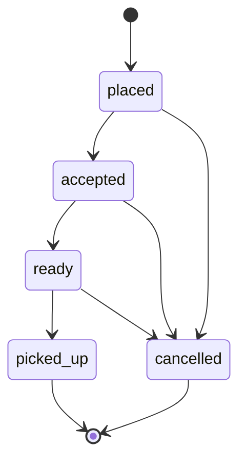

# Order lifecycle

## Overview

An order represents a customer's intent to pick up products from a single merchant. Payment happens outside the platform; airRand tracks fulfillment state only.

**Guest checkout:** customers do not sign up. They provide a **phone number** (required) and optional name at cart submit. The API stores `customer_contact` and optional `customer_name` for merchant operations only — see [customer-data-policy.md](./customer-data-policy.md).

## Statuses

| Status | Meaning | Set by |
|--------|---------|--------|
| `placed` | Customer submitted order | System (on create) |
| `accepted` | Merchant acknowledged order | Merchant |
| `ready` | Order prepared for pickup | Merchant |
| `picked_up` | Customer collected order; QR verified | Merchant (via scan) |
| `cancelled` | Order will not be fulfilled | Merchant or system policy |

## Allowed transitions

Invalid transitions are rejected by `@airrand/domain` (`canTransitionOrderStatus`, `assertCanTransitionOrderStatus`) and enforced on `PATCH /merchants/:merchantId/orders/:orderId/status` (409 on invalid transition).

## Pickup verification (Phase 2)

1. On order creation, the API issues an HMAC-signed pickup token and stores `pickup_token_nonce` + `pickup_token_expires_at` on the order. The create-order response includes `{ pickup: { token, expiresAt } }`.
2. The customer displays the token as a QR code (UI in Phase 4).
3. When the order is `ready`, the merchant calls `POST /merchants/:merchantId/orders/:orderId/pickup/verify` with `{ token }`.
4. The API verifies signature, expiry, route/order/merchant match, nonce, and `ready` status, then transitions to `picked_up` and sets `picked_up_at`.

| HTTP | Code | When |
|------|------|------|
| 400 | `MALFORMED_TOKEN`, `INVALID_SIGNATURE`, `MERCHANT_MISMATCH`, `ORDER_MISMATCH`, `TOKEN_NONCE_MISMATCH` | Invalid token |
| 404 | `ORDER_NOT_FOUND` | Unknown order |
| 409 | `ORDER_NOT_READY`, `ORDER_ALREADY_PICKED_UP` | Wrong lifecycle state |
| 410 | `EXPIRED_TOKEN` | Past `expiresAt` |

Tokens encode only `orderId`, `merchantId`, `issuedAt`, `expiresAt`, and `nonce` — no payment or wallet data.

## What is not modeled

- `paid` / `refunded` / `settled` statuses
- Wallet debits or balances
- Payment intents or processor webhooks

Merchants may use their own POS or cash; that is outside this lifecycle.

## Customer data after fulfillment

Per [customer-data-policy.md](./customer-data-policy.md), name and phone on orders are **operational only**. Automatic purge or anonymization after terminal states is documented but **not implemented** in MVP.

## Audit (later)

Phase 5 may add `order_status_events` (who, when, from → to). Not required for Phase 1.
