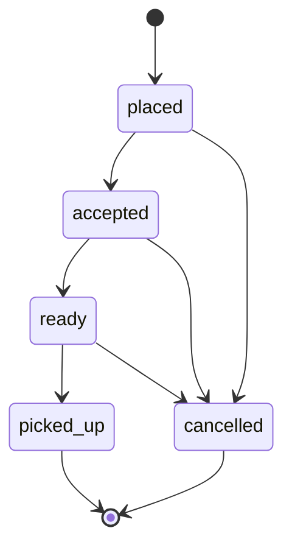

# Order lifecycle

## Overview

An order represents a customer's intent to pick up products from a single merchant. Payment happens outside the platform; airRand tracks fulfillment state only.

## Statuses

| Status | Meaning | Set by |
|--------|---------|--------|
| `placed` | Customer submitted order | System (on create) |
| `accepted` | Merchant acknowledged order | Merchant |
| `ready` | Order prepared for pickup | Merchant |
| `picked_up` | Customer collected order; QR verified | Merchant (via scan) |
| `cancelled` | Order will not be fulfilled | Merchant or system policy |

## Allowed transitions

Invalid transitions must be rejected by `@airrand/domain` and the API (Phase 1).

## Pickup verification (Phase 2+)

1. On order creation, API issues a pickup token (encoded in QR).
2. Customer displays QR at counter.
3. Merchant app scans QR → API verifies signature, expiry, and order state.
4. On success, order moves to `picked_up` (idempotent if already picked up).

Tokens must not encode payment or wallet data.

## What is not modeled

- `paid` / `refunded` / `settled` statuses
- Wallet debits or balances
- Payment intents or processor webhooks

Merchants may use their own POS or cash; that is outside this lifecycle.

## Audit (later)

Phase 5 may add `order_status_events` (who, when, from → to). Not required for Phase 1.
